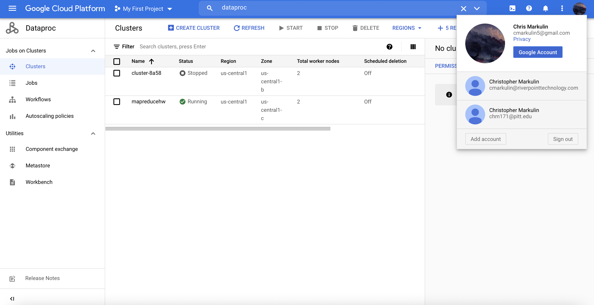
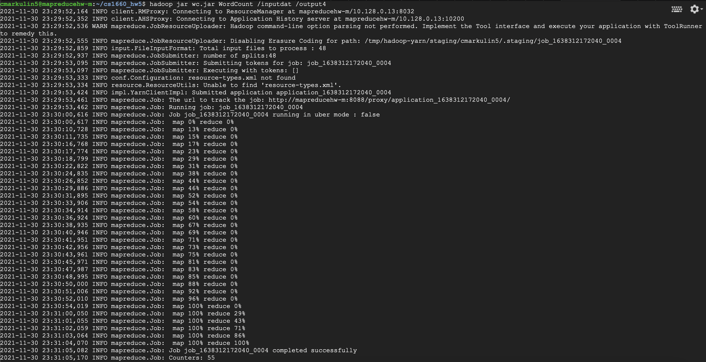
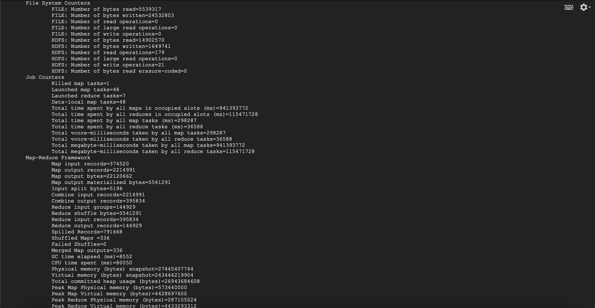
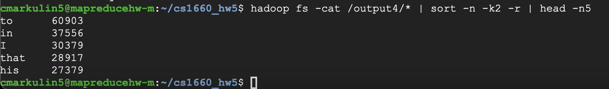

# Top-5 Word Count Map Reduce Homework

Screenshot of GCP Account (25%):

Copy of Source Code (25%):  

The source code is found at [here](./WordCount.java)

Copy of Execution (25%):

Copy of Output (25%):
  

The output file can be found [here](./top5.txt)

Note:  
The source code is mostly WordCount.java, but I filtered out the list of words that we were told to. The sorting and top 5 search is conducted after the map reduce job through built in HDFS functions, which you can see in the output screenshot. I know that this isn't how we were supposed to do this, but I underestimated how long it would take to actually develop the custom Map Reduce algorithm.
